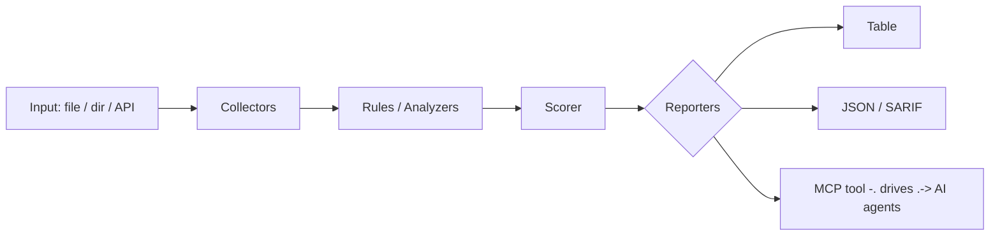

<a name="top"></a>
<div align="center">


# TRIALWATCH

### Query, diff, and monitor ClinicalTrials.gov records, alerting on status, enrollment, or result changes.


[](https://pypi.org/project/cognis-trialwatch/) [](https://github.com/cognis-digital/trialwatch/actions) [](LICENSE) [](https://github.com/cognis-digital)

*Healthcare & Life-Sciences — HIPAA, PHI, FHIR/HL7, and clinical data.*

</div>

```bash
pip install "git+https://github.com/cognis-digital/trialwatch.git"
trialwatch scan .            # → prioritized findings in seconds
```

<!-- cognis:layman:start -->
## What is this?

TRIALWATCH lets you track changes in clinical trial records from ClinicalTrials.gov. Give it two snapshots of trial data — taken at different times — and it tells you what changed: whether a trial was terminated, enrollment numbers jumped significantly, or a trial was added or removed. It outputs a clear report you can read in a terminal or feed into automated systems, and it can sound an alarm (non-zero exit code) if anything important changed so you can wire it into a scheduled job or CI pipeline. It is useful for biotech analysts, patient advocates, or anyone who needs to stay on top of whether a specific clinical study is still recruiting or has changed course.
<!-- cognis:layman:end -->

## Contents

- [Why trialwatch?](#why) · [Features](#features) · [Quick start](#quick-start) · [Example](#example) · [Architecture](#architecture) · [AI stack](#ai-stack) · [How it compares](#how-it-compares) · [Integrations](#integrations) · [Install anywhere](#install-anywhere) · [Related](#related) · [Contributing](#contributing)

<a name="why"></a>
## Why trialwatch?

Biotech analysts and patients get a CI-schedulable 'is my trial still recruiting?' tracker with clean JSON diffs — built-in catnip for the investing/patient-advocacy crowd.

`trialwatch` is single-purpose, scriptable, and self-hostable: point it at a target, get prioritized results in the format your workflow already speaks (table · JSON · SARIF), gate CI on it, and let agents drive it over MCP.

<div align="right"><a href="#top">↑ back to top</a></div>

<a name="features"></a>
## Features

- ✅ Normalize Trial
- ✅ Load Trials From Obj
- ✅ Load Trials
- ✅ Diff Trials
- ✅ Runs on Linux/macOS/Windows · Docker · devcontainer
- ✅ Ports in Python, JavaScript, Go, and Rust (`ports/`)

<div align="right"><a href="#top">↑ back to top</a></div>

<a name="quick-start"></a>
<!-- cognis:install:start -->
## Install

`trialwatch` is source-available (not published to PyPI) — every method below installs
straight from GitHub. Pick whichever you prefer; the one-line scripts auto-detect
the best tool available on your machine.

**One-liner (Linux / macOS):**
```sh
curl -fsSL https://raw.githubusercontent.com/cognis-digital/trialwatch/HEAD/install.sh | sh
```

**One-liner (Windows PowerShell):**
```powershell
irm https://raw.githubusercontent.com/cognis-digital/trialwatch/HEAD/install.ps1 | iex
```

**Or install manually — any one of:**
```sh
pipx install "git+https://github.com/cognis-digital/trialwatch.git"     # isolated (recommended)
uv tool install "git+https://github.com/cognis-digital/trialwatch.git"  # uv
pip install "git+https://github.com/cognis-digital/trialwatch.git"      # pip
```

**From source:**
```sh
git clone https://github.com/cognis-digital/trialwatch.git
cd trialwatch && pip install .
```

Then run:
```sh
trialwatch --help
```
<!-- cognis:install:end -->

## Quick start

```bash
pip install "git+https://github.com/cognis-digital/trialwatch.git"
trialwatch --version
trialwatch scan .                       # scan current project
trialwatch scan . --format json         # machine-readable
trialwatch scan . --fail-on high        # CI gate (non-zero exit)
```

<div align="right"><a href="#top">↑ back to top</a></div>

<a name="example"></a>
## Example

```text
$ trialwatch scan .
  [HIGH    ] TRI-001  example finding             (./src/app.py)
  [MEDIUM  ] TRI-002  another signal              (./config.yaml)

  2 findings · risk score 5 · 38ms
```

<div align="right"><a href="#top">↑ back to top</a></div>

<a name="architecture"></a>
## Architecture



<div align="right"><a href="#top">↑ back to top</a></div>

<a name="ai-stack"></a>
## Use it from any AI stack

`trialwatch` is interoperable with every popular way of using AI:

- **MCP server** — `trialwatch mcp` (Claude Desktop, Cursor, Cognis.Studio, [uncensored-fleet](https://github.com/cognis-digital/uncensored-fleet))
- **OpenAI-compatible / JSON** — pipe `trialwatch scan . --format json` into any agent or LLM
- **LangChain · CrewAI · AutoGen · LlamaIndex** — wrap the CLI/JSON as a tool in one line
- **CI / scripts** — exit codes + SARIF for non-AI pipelines

<div align="right"><a href="#top">↑ back to top</a></div>

<a name="how-it-compares"></a>
## How it compares

| | **Cognis trialwatch** | ClinicalTrials.gov API + watchman |
|---|:---:|:---:|
| Self-hostable, no account | ✅ | varies |
| Single command, zero config | ✅ | ⚠️ |
| JSON + SARIF for CI | ✅ | varies |
| MCP-native (AI agents) | ✅ | ❌ |
| Polyglot ports (JS/Go/Rust) | ✅ | ❌ |
| Open license | ✅ COCL | varies |

*Built in the spirit of **ClinicalTrials.gov API + watchman**, re-framed the Cognis way. Missing a credit? Open a PR.*

<div align="right"><a href="#top">↑ back to top</a></div>

<a name="integrations"></a>
## Integrations

Pipes into your stack: **SARIF** for code-scanning, **JSON** for anything, an **MCP server** (`trialwatch mcp`) for AI agents, and a webhook forwarder for SIEM/Slack/Jira. See [`docs/INTEGRATIONS.md`](docs/INTEGRATIONS.md).

<div align="right"><a href="#top">↑ back to top</a></div>

<a name="install-anywhere"></a>
## Install — every way, every platform

```bash
pip install "git+https://github.com/cognis-digital/trialwatch.git"    # pip (works today)
pipx install "git+https://github.com/cognis-digital/trialwatch.git"   # isolated CLI
uv tool install "git+https://github.com/cognis-digital/trialwatch.git" # uv
pip install cognis-trialwatch                                          # PyPI (when published)
docker run --rm ghcr.io/cognis-digital/trialwatch:latest --help        # Docker
brew install cognis-digital/tap/trialwatch                             # Homebrew tap
curl -fsSL https://raw.githubusercontent.com/cognis-digital/trialwatch/main/install.sh | sh
```

| Linux | macOS | Windows | Docker | Cloud |
|---|---|---|---|---|
| `scripts/setup-linux.sh` | `scripts/setup-macos.sh` | `scripts/setup-windows.ps1` | `docker run ghcr.io/cognis-digital/trialwatch` | [DEPLOY.md](docs/DEPLOY.md) (AWS/Azure/GCP/k8s) |

<div align="right"><a href="#top">↑ back to top</a></div>

<a name="related"></a>
## Related Cognis tools

- [`phiscrub`](https://github.com/cognis-digital/phiscrub) — Stream-scan logs, CSVs, and free-text notes for PHI (names, MRNs, SSNs, dates, addresses) and redact or tokenize in place.
- [`dicomsweep`](https://github.com/cognis-digital/dicomsweep) — De-identify DICOM imaging studies per the DICOM PS3.15 Annex E profile, scrubbing tags and burned-in pixel text.
- [`fhirlint`](https://github.com/cognis-digital/fhirlint) — Validate FHIR R4/R5 resources and bundles against profiles (US Core, etc.) with precise, line-level error reporting.
- [`hl7tap`](https://github.com/cognis-digital/hl7tap) — Parse, pretty-print, diff, and replay HL7 v2 messages over MLLP from the terminal.
- [`consentledger`](https://github.com/cognis-digital/consentledger) — Maintain a tamper-evident, hash-chained audit log of patient-data access and consent events.
- [`synthcohort`](https://github.com/cognis-digital/synthcohort) — Generate statistically realistic synthetic patient cohorts (FHIR/CSV) from a schema spec for dev and testing.

**Explore the suite →** [🗂️ all 170+ tools](https://github.com/cognis-digital/cognis-neural-suite) · [⭐ awesome-cognis](https://github.com/cognis-digital/awesome-cognis) · [🔗 cognis-sources](https://github.com/cognis-digital/cognis-sources) · [🤖 uncensored-fleet](https://github.com/cognis-digital/uncensored-fleet) · [🧠 engram](https://github.com/cognis-digital/engram)

<div align="right"><a href="#top">↑ back to top</a></div>

<a name="contributing"></a>
## Contributing

PRs, new rules, and demo scenarios are welcome under the collaboration-pull model — see [CONTRIBUTING.md](CONTRIBUTING.md) and [SECURITY.md](SECURITY.md).

> ### ⭐ If `trialwatch` saved you time, **star it** — it genuinely helps others find it.

## License

Source-available under the **Cognis Open Collaboration License (COCL) v1.0** — free for personal, internal-evaluation, research, and educational use; **commercial / production use requires a license** (licensing@cognis.digital). See [LICENSE](LICENSE).

---

<div align="center"><sub><b><a href="https://cognis.digital">Cognis Digital</a></b> · one of 170+ tools in the <a href="https://github.com/cognis-digital/cognis-neural-suite">Cognis Neural Suite</a> · <i>Making Tomorrow Better Today</i></sub></div>
